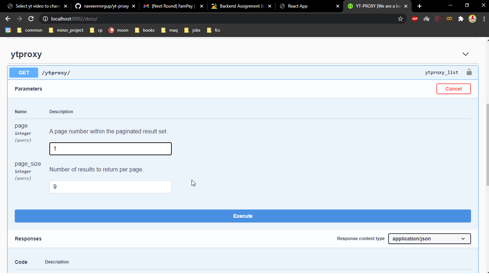

# YT-PROXY [We are a backup for youtube's news videos]

### Backend packages used:

1. django - web server framework
1. drf - facilitates REST API development in djnago
1. celery - to perform async tasks with rabbitmq🐇 as the broker 
1. cryptography - to crypt sensitive information
1. django-celery-beat - to schedule periodic tasks leveraging celery with django admin GUI
1. drf-yasg - to create swagger docs [`http://<base-url>/docs/`]
1. python-decouple - to hide sensitive info in .env file
1. django-cors-headers - to enable CORS access to other application

### Frontend packages used:

1. react.js - choice of web framework [`http://<base-url>/`]
1. bootstrap 4 - choice of UI library

### Screenshots:

