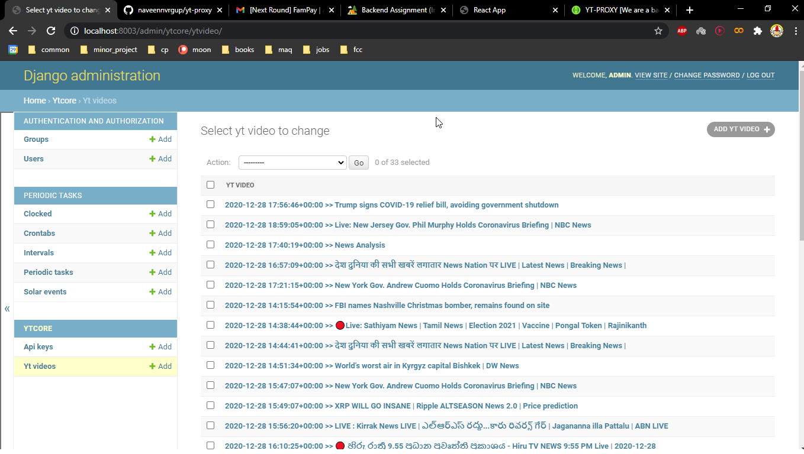
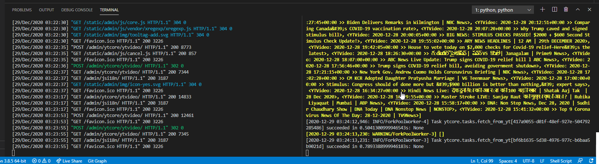
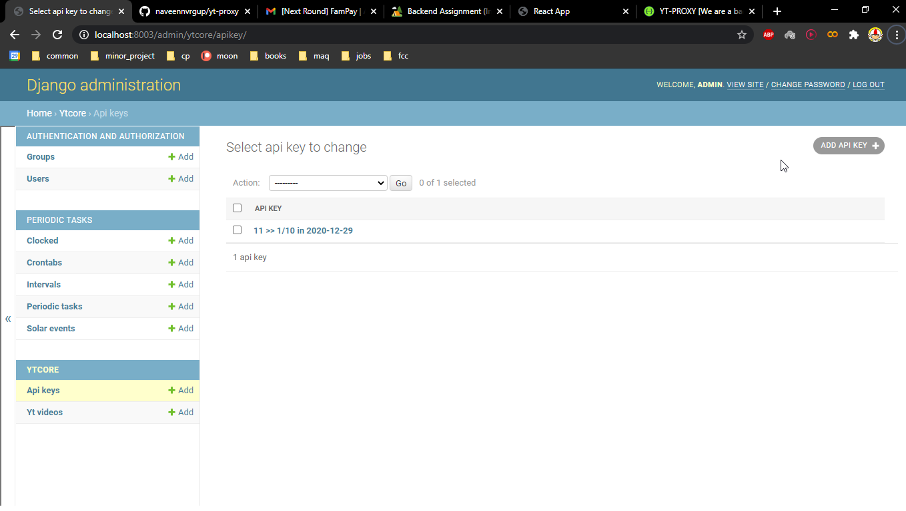
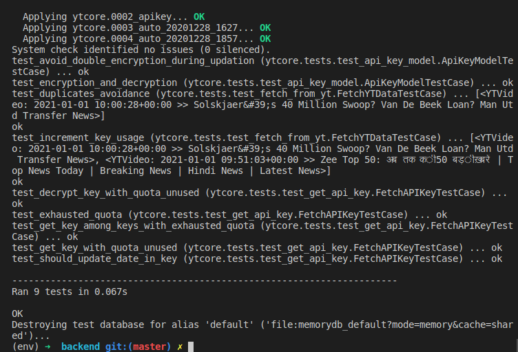
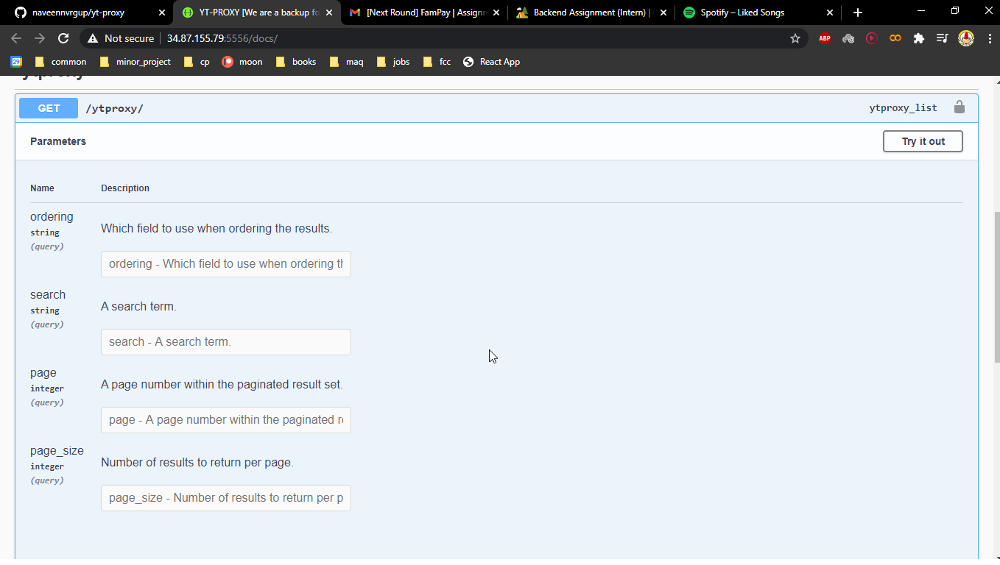
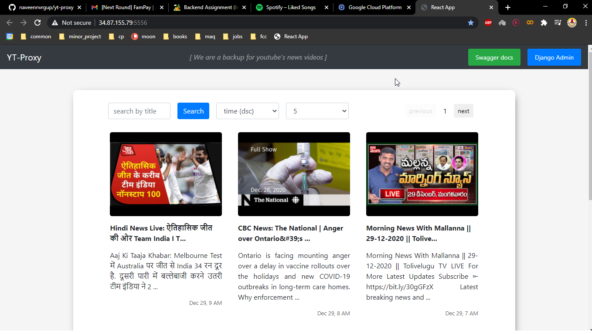
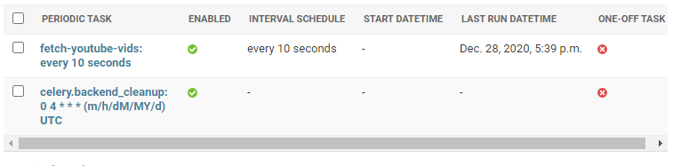

# YT-PROXY [We are a backup for youtube's news videos] [hosted here🐁](http://34.87.142.140:5556/)

### Checkout hosted server [here 🎯](http://34.87.142.140:5556/)
1. [react ui here](http://34.87.142.140:5556/)
1. [swagger docs here](http://34.87.142.140:5556/docs/)
1. [django admin here](http://34.87.142.140:5556/admin/login/?next=/admin/)
    - username: `admin`
    - password: `admin`

### Features

- Server calls the YouTube API continuously in background (async) with interval of 10 seconds for fetching the latest videos for a predefined search query.
- A GET API which returns the stored video data in a paginated response sorted in descending order of published datetime.
- Support for supplying multiple API keys so that if quota is exhausted on one, it automatically uses the next available key. 
- A dashboard to view the stored videos with filtering and sorting options.
- 9 Unit tests are added for the backend at `ytcore.tests`. 


### Run Backend

* Clone repository
* `cd backend` 
* create `.env` file with
```
HOSTED_RABBITMQ=<uri-of-rabbitmq>
GGL_API_KEY=<youtube-data-api-key>
SECRET_KEY=<fernet-key checkout https://cryptography.io/en/latest/> 
DJANGO_SECRET=<choice-of-django-secret-key>
``` 
* Open two terminals
* In terminal 1: `source provision.sh`. This will:
    - create a virtual env
    - install requirements
    - run migrations
    - fill datbase with sample data 
    - create an admin user
    - start server at [http://localhost:5557/](http://localhost:5557/)
* In terminal 2: `source start-celery.sh`. This will run celery and every 10 seconds fetch youtube data. The task can be located at `ytcore.tasks.fetch_from_yt`. The celery config is present at `server.celery`.
* To run the test suite `python manage.py test`


### Run Frontend

* `cd frontend`
* `npm install`
* `npm start`

### Backend packages used:

1. django - web server framework
1. drf - facilitates REST API development in django
1. celery - to perform async tasks with rabbitmq🐇 as the broker 
1. cryptography - to crypt sensitive information
1. django-celery-beat - to schedule periodic tasks leveraging celery with django admin GUI
1. drf-yasg - to create swagger docs [`http://<base-url>/docs/`]
1. python-decouple - to hide sensitive info in .env file
1. django-cors-headers - to enable CORS access to other application


### Frontend packages used:

1. react.js - choice of web framework [`http://<base-url>/`]
1. bootstrap 4 - choice of UI library


### Screenshots:








